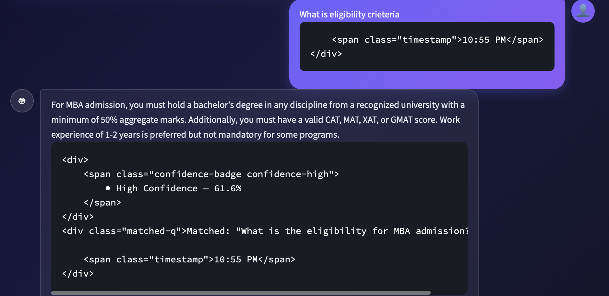

<h1 align="center">
  🎓 College Admissions FAQ Chatbot
</h1>

<p align="center">
  
  
  
  
  
</p>

<p align="center">
  <b>An intelligent NLP-powered FAQ Chatbot that understands natural language questions<br>
  and returns the most relevant answer using TF-IDF Vectorization and Cosine Similarity.</b>
</p>

<p align="center">
  <i>🏆 Built as part of the <strong>CodeAlpha Artificial Intelligence Internship</strong></i>
</p>

---

## 📋 Table of Contents

- [Project Overview](#-project-overview)
- [Live Demo](#-live-demo)
- [Features](#-features)
- [Technologies Used](#-technologies-used)
- [Project Structure](#-project-structure)
- [Installation Guide](#-installation-guide)
- [How To Run](#-how-to-run)
- [How It Works](#-how-it-works)
- [Screenshots](#-screenshots)
- [FAQ Database](#-faq-database)
- [Future Improvements](#-future-improvements)
- [CodeAlpha Internship](#-codealpha-internship)
- [License](#-license)

---

## 🧠 Project Overview

The **College Admissions FAQ Chatbot** is an AI-powered conversational assistant built to help prospective students instantly find answers to common college admission queries. Instead of browsing through lengthy websites or waiting for email replies, students can simply type their question in natural language and receive the most relevant answer within seconds.

The chatbot leverages **Natural Language Processing (NLP)** techniques including text preprocessing, tokenization, stopword removal, and lemmatization — combined with **TF-IDF Vectorization** and **Cosine Similarity** to semantically match the user's question to the closest FAQ entry in the database.

### 🎯 Problem Statement
Students applying to colleges often have many questions about admissions, fees, scholarships, hostels, placements, and more. Traditional FAQ pages are hard to navigate and often require exact keyword searches. This chatbot solves that by understanding the *intent* behind the question.

### ✅ Solution
A smart FAQ chatbot that:
- Understands natural language queries
- Preprocesses text using NLP pipelines
- Matches questions using TF-IDF + Cosine Similarity
- Returns the most relevant answer with a confidence score

---

## 🚀 Live Demo

> Run locally by following the [Installation Guide](#-installation-guide) below.

---

## ✨ Features

| Feature | Description |
|---|---|
| 🔤 **Natural Language Understanding** | Users can ask questions in plain English without exact keyword matching |
| 🧹 **NLP Preprocessing Pipeline** | Lowercasing → Cleaning → Tokenization → Stopword Removal → Lemmatization |
| 📐 **TF-IDF Vectorization** | Converts text to numerical vectors for mathematical comparison |
| 📏 **Cosine Similarity Matching** | Finds the most semantically similar FAQ to the user's question |
| 🎯 **Confidence Score Display** | Every answer shows a confidence percentage (High / Medium / Low) |
| 💬 **Chat Bubble UI** | Beautiful dark-themed chat interface with styled user and bot bubbles |
| 📜 **Full Chat History** | Entire conversation is preserved and displayed within the session |
| 🗑️ **Clear Chat Button** | Reset the conversation with a single click |
| 📊 **Live Session Statistics** | Tracks total queries, successful matches, and match rate |
| 🗂️ **Sidebar Information Panel** | Shows FAQ database stats, topic coverage, and tech stack |
| ⚠️ **Low Confidence Fallback** | Gracefully handles unrecognized questions with a helpful message |
| 🔒 **Full Error Handling** | Handles missing files, corrupt JSON, empty queries, and runtime errors |
| ♻️ **NLTK Auto-Download** | Automatically downloads required NLTK resources on first launch |
| 📱 **Responsive Layout** | Clean, responsive design that works across screen sizes |

---

## 🛠️ Technologies Used

### Core
| Technology | Version | Purpose |
|---|---|---|
| Python | 3.11+ | Core programming language |
| Streamlit | 1.35.0 | Web application framework |

### NLP & Machine Learning
| Technology | Version | Purpose |
|---|---|---|
| NLTK | 3.8.1 | Tokenization, Stopword Removal, Lemmatization |
| Scikit-learn | 1.4.2 | TF-IDF Vectorization, Cosine Similarity |
| NumPy | 1.26.4 | Numerical array operations |

### Supporting Libraries
| Technology | Version | Purpose |
|---|---|---|
| Pandas | 2.2.2 | Data handling utilities |
| python-dotenv | 1.0.1 | Environment variable management |

---

## 📁 Project Structure

```
CodeAlpha_FAQChatbot/
│
├── app.py                  # Main Streamlit application
├── faq_data.json           # FAQ database (50+ Q&A pairs)
├── requirements.txt        # Python dependencies
├── README.md               # Project documentation (this file)
├── .gitignore              # Git ignore rules
│
├── screenshots/            # App screenshots for README
│   ├── chatbot_ui.png
│   └── response_bot.png
│
└── assets/                 # Static assets (icons, branding)
```

### Key Files

| File | Description |
|---|---|
| `app.py` | Complete Streamlit chatbot application with NLP engine, UI components, and session management |
| `faq_data.json` | Curated dataset of 50+ college admission FAQs across 10 topic categories |
| `requirements.txt` | All required Python packages with pinned versions for reproducibility |
| `.gitignore` | Properly configured to exclude venv, caches, IDE files, and secrets |

---

## ⚙️ Installation Guide

### Prerequisites

- **Python 3.11 or higher** — [Download here](https://www.python.org/downloads/)
- **pip** (comes bundled with Python)
- **Git** — [Download here](https://git-scm.com/)

### Step 1: Clone the Repository

```bash
git clone https://github.com/YOUR_USERNAME/CodeAlpha_FAQChatbot.git
cd CodeAlpha_FAQChatbot
```

### Step 2: Create a Virtual Environment

```bash
# Create virtual environment
python -m venv venv

# Activate on macOS/Linux
source venv/bin/activate

# Activate on Windows
venv\Scripts\activate
```

### Step 3: Install Dependencies

```bash
pip install -r requirements.txt
```

> **Note:** NLTK resources (`punkt`, `stopwords`, `wordnet`) are automatically downloaded on the first run. No manual setup needed.

---

## ▶️ How To Run

```bash
streamlit run app.py
```

The application will open automatically in your default browser at:

```
http://localhost:8501
```

### Stopping the App

Press `Ctrl + C` in the terminal to stop the Streamlit server.

---

## ⚙️ How It Works

The chatbot uses a classical NLP pipeline to match user queries to FAQ entries:

```
User Query
    │
    ▼
┌─────────────────────────────────────┐
│         TEXT PREPROCESSING          │
│  1. Lowercase                       │
│  2. Remove special chars / URLs     │
│  3. Tokenize (NLTK word_tokenize)   │
│  4. Remove Stopwords (NLTK)         │
│  5. Lemmatize (WordNetLemmatizer)   │
└─────────────────────────────────────┘
    │
    ▼
┌─────────────────────────────────────┐
│       TF-IDF VECTORIZATION          │
│  Transform cleaned query using      │
│  pre-fitted TF-IDF model            │
│  (unigrams + bigrams, sublinear TF) │
└─────────────────────────────────────┘
    │
    ▼
┌─────────────────────────────────────┐
│       COSINE SIMILARITY             │
│  Compare query vector against all   │
│  FAQ question vectors               │
│  → Select highest similarity score  │
└─────────────────────────────────────┘
    │
    ▼
┌─────────────────────────────────────┐
│       THRESHOLD CHECK               │
│  score ≥ 0.15 → Return Answer       │
│  score < 0.15 → Fallback Message    │
└─────────────────────────────────────┘
    │
    ▼
  Answer + Confidence Score Displayed
```

### Confidence Score Levels

| Level | Score Range | Color |
|---|---|---|
| 🟢 High Confidence | ≥ 45% | Green |
| 🟡 Medium Confidence | 25% – 44% | Yellow |
| 🔴 Low Confidence | 15% – 24% | Red |
| ❌ No Match | < 15% | Fallback message |

---

## 📸 Screenshots

> _Screenshots are saved in the `screenshots/` folder after running the application._

### Chatbot Interface



### Response Display


---

## 📚 FAQ Database

The `faq_data.json` contains **50+ curated FAQs** about college admissions organized across **10 topic categories**:

| # | Category | Sample Questions |
|---|---|---|
| 1 | 🏫 **Admissions** | Last date to apply, how to apply online, management quota |
| 2 | 📋 **Eligibility** | Minimum percentage for B.Tech, age limit, lateral entry |
| 3 | 💰 **Fees** | Annual tuition, additional fees, installment facility, refund policy |
| 4 | 🎓 **Scholarships** | Merit scholarships, SC/ST scholarships, sports scholarships |
| 5 | 🏠 **Hostel** | Room types & fees, mess facility, curfew, male/female hostels |
| 6 | 💼 **Placements** | Placement record, recruiting companies, average salary, internships |
| 7 | 📄 **Documents** | Required documents, verification process, migration certificate |
| 8 | 📚 **Courses** | UG/PG programs, Ph.D., certificate courses, program duration |
| 9 | 📅 **Attendance** | Minimum requirement, digital tracking, medical condonation |
| 10 | 📝 **Examinations** | Exam structure, passing criteria, grace marks, re-evaluation, CGPA |

---

## 🔮 Future Improvements

- [ ] **Deep Learning Integration** — Use BERT/Sentence Transformers for semantic embeddings and better accuracy
- [ ] **Multi-topic Support** — Extend FAQ database to cover multiple college departments
- [ ] **Voice Input** — Add speech-to-text support for hands-free querying
- [ ] **Admin Dashboard** — Allow administrators to add/edit/delete FAQs dynamically via UI
- [ ] **Database Backend** — Migrate from JSON to PostgreSQL or MongoDB for scalability
- [ ] **Analytics Dashboard** — Visualize most-asked questions, unanswered queries, and usage trends
- [ ] **Multi-language Support** — Add support for regional Indian languages using translation APIs
- [ ] **WhatsApp / Telegram Bot** — Deploy as a messaging bot using Twilio or Telegram Bot API
- [ ] **User Feedback Loop** — Allow users to rate answers for continuous improvement
- [ ] **Contextual Memory** — Implement conversation history awareness for follow-up questions

---

## 🏆 CodeAlpha Internship

This project was developed as **Task 1 – FAQ Chatbot** during the **Artificial Intelligence Internship** at **[CodeAlpha](https://www.codealpha.tech/)**.

| Detail | Info |
|---|---|
| 🏢 Organization | CodeAlpha |
| 📌 Internship Domain | Artificial Intelligence |
| 📁 Task | FAQ Chatbot |
| 🛠️ Tech Stack | Python, Streamlit, NLTK, Scikit-learn |
| 📅 Year | 2026 |

> *CodeAlpha is a leading tech internship platform providing hands-on experience in AI, Machine Learning, Web Development, and more.*

---

## 📄 License

This project is licensed under the **MIT License**.

```
MIT License

Copyright (c) 2026 Subhajit Roy

Permission is hereby granted, free of charge, to any person obtaining a copy
of this software and associated documentation files (the "Software"), to deal
in the Software without restriction, including without limitation the rights
to use, copy, modify, merge, publish, distribute, sublicense, and/or sell
copies of the Software, and to permit persons to whom the Software is
furnished to do so, subject to the following conditions:

The above copyright notice and this permission notice shall be included in all
copies or substantial portions of the Software.

THE SOFTWARE IS PROVIDED "AS IS", WITHOUT WARRANTY OF ANY KIND.
```

---

<p align="center">
  Made with ❤️ for the <strong>CodeAlpha AI Internship</strong><br>
  ⭐ Star this repository if you found it helpful!
</p>
